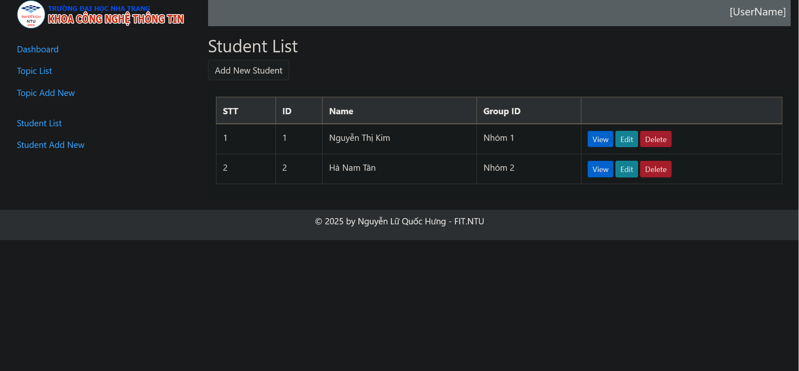
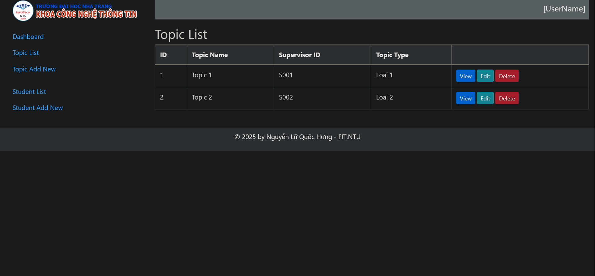
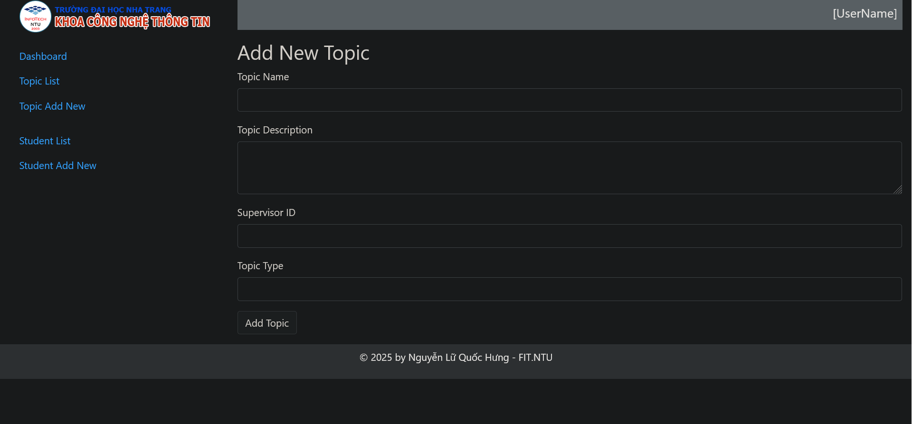
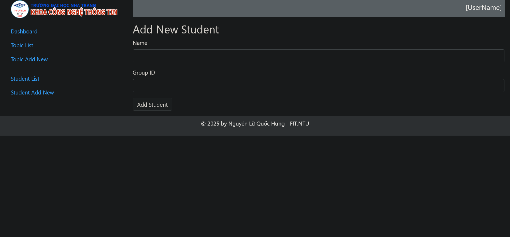

# 64133129_Web2

👋 Xin chào!

Mình là một lập trình viên phần mềm đang trên hành trình làm chủ Java, Tomcat và Servlet. Hiện tại, mình đang theo học ngành Khoa học Máy tính. Java là ngôn ngữ lập trình đầu tiên mình học khi vào đại học, và theo thời gian, mình càng trở nên hứng thú hơn. Bây giờ, mình rất hào hứng khám phá thế giới của các ứng dụng web Java. Dưới đây là một chút về nền tảng, sở thích và các dự án của mình!

________________________________________

📘 Tại sao lại là Java và Servlet?

Java giới thiệu cho mình về lập trình hướng đối tượng, giúp mình nắm bắt các khái niệm cơ bản như đóng gói, kế thừa và đa hình. Mình thích cấu trúc chặt chẽ của Java, các thư viện phong phú và sự ứng dụng rộng rãi trong các dự án thực tế. Khám phá Servlet đã mở ra cho mình một chiều hướng mới trong việc xây dựng các ứng dụng web động, cung cấp cho mình nền tảng vững chắc cho phát triển web.

________________________________________

🌐 Khám phá Java, Tomcat và Servlet

Tomcat là máy chủ mình chọn để triển khai Servlet và JSP, cho phép mình tạo ra các ứng dụng web tương tác và động. Mình đã học cách cấu hình Tomcat, quản lý ứng dụng web và hiểu sâu hơn về cách hoạt động của Servlet. Điều mình thấy hứng thú nhất? Khả năng tạo ra các ứng dụng web mạnh mẽ và có thể mở rộng, đáp ứng các thách thức thực tế.

________________________________________

📂 Dự án và Kinh nghiệm Thực tế

Là một sinh viên, mình đã có cơ hội làm việc trên một số dự án thú vị, cả làm cá nhân và theo nhóm. Dưới đây là một vài dự án mà mình tự hào nhất:

• Hệ Thống Quản Lý Thư Viện: Thiết kế và phát triển ứng dụng web để quản lý tài nguyên thư viện, bao gồm danh mục sách, tài khoản học sinh và lịch sử mượn/trả. Dự án này giúp mình hiểu sâu hơn về Servlet, JSP và kết nối cơ sở dữ liệu.

• Ứng dụng To-Do List: Tạo một ứng dụng to-do list thân thiện với người dùng bằng Servlet và JSP. Mình đã tích hợp giao diện quản lý nhiệm vụ và triển khai tính năng lưu/tải để lưu dữ liệu kể cả khi đóng ứng dụng.

• Phát triển Game Đơn Giản: Thử nghiệm với Servlet để tạo một trò chơi web đơn giản. Đây là một cách vui để học về quản lý phiên làm việc, xử lý sự kiện và một chút AI cho logic trò chơi!

________________________________________

🛠️ Kỹ Năng Kỹ Thuật

• Ngôn ngữ: Java

• Công nghệ: Servlet, JSP, Tomcat

• Công cụ: Eclipse, IntelliJ IDEA, Git/GitHub

• Khái niệm: Lập trình Hướng đối tượng (OOP), các mẫu thiết kế cơ bản và một chút kiến thức về kiến trúc MVC

________________________________________

📈 Dự Định Sắp Tới

Mình luôn mong muốn mở rộng kiến thức và tham gia vào các dự án thực tế mới. Mục tiêu của mình là không ngừng trau dồi kỹ năng Java và khám phá thêm các framework và thư viện khác để mở rộng bộ công cụ phát triển của mình. Khi tiếp tục con đường học vấn, mình sẵn sàng tham gia vào các kỳ thực tập và hợp tác để có thể học hỏi và phát triển thêm.

________________________________________

📬 Kết Nối Với Mình!

Nếu bạn quan tâm đến việc thảo luận dự án, chia sẻ ý tưởng, hoặc kết nối với một người cùng đam mê Java, đừng ngần ngại liên hệ! Bạn có thể gửi email đến hung.nlq.64cntt@ntu.edu.vn.